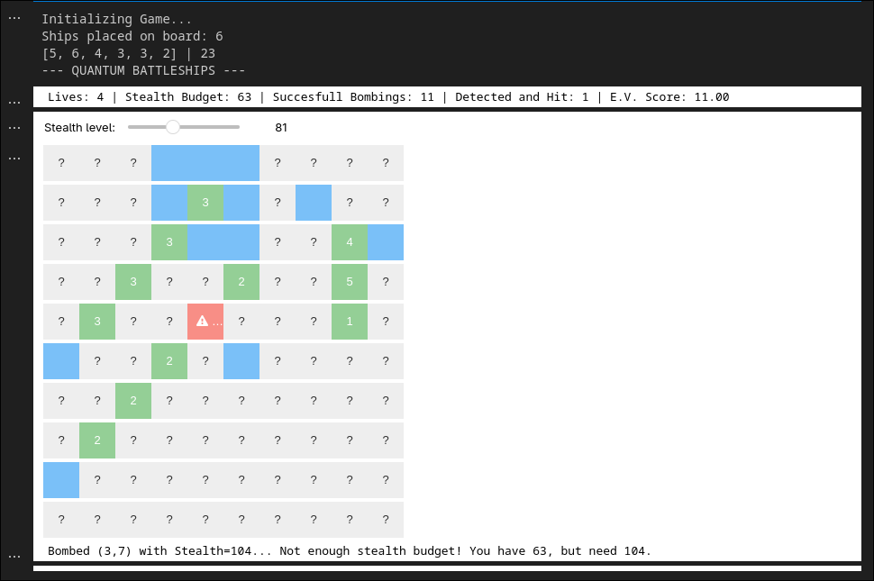
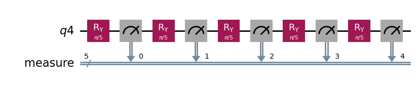

# 🛸 Quantum Battleships (UCLQFF2025)


A hybrid classical-quantum game for the **UCL Qiskit Fall Fest 2025**, submitted by Shamith Guniyangodage. This project is a playable game, built inside a Jupyter Notebook, based on the physics of the **Quantum Zeno Effect**.

 
<!-- Make sure to add a real screenshot of your game here! -->

## 💡 Core Concept: The "Stealth Bomb"

In Quantum Battleships, you have one primary action: **Bomb** a square. To win, you must successfully **bomb** every square occupied by a ship.

This is where the game becomes quantum.

### The "Stealth Bomb" Mechanic (The Quantum Zeno Effect)

Whenever you **bomb** a square that contains a ship, there is a probability that you are **spotted and hit back**, costing you a life.

You have a **limited "Stealth Budget"** (your `stealth_pnts`). When you decide to bomb a square, you must also decide how many **Stealth Points ($N$)** to spend on that *single attack*.

This $N$ value *is* your "Probe Power" and directly determines your risk, based on the physics of the **Quantum Zeno ("Watched Pot") Effect** (from the `UCL QFF 2025 - Quantum bomb and the watched pot effect.ipynb` notebook).

* The **"Stealth Points ($N$)"** you spend are the number of "gentle peeks" (repeated measurements) the quantum circuit will perform.
* The **"Hit Back"** is the "Explosion" outcome.

This creates a high-stakes trade-off:

| Probe Type | Cost (Stealth Points) | Risk of being "Spotted" | Reward (Safe Hit) |
| :--- | :--- | :--- | :--- |
| **Reckless Bomb** (Low $N$, e.g., `N=2`) | Very **Cheap** (costs 2) | Very **High** (~76%) | Very **Low** (~24%) |
| **Stealth Bomb** (High $N$, e.g., `N=50`) | Very **Expensive** (costs 50) | Very **Low** (~9%) | Very **High** (~91%) |

*(Probabilities based on experimental results from the notebook `image_bd2143.png`)*

### How to Win

You win by successfully bombing all ship segments before you run out of lives or your Stealth Budget. Your final score is your **E.V. Score (Safe Hits / Times Spotted)**, rewarding a stealthy, quantum-based playthrough.

---

## 🔬 Project Report (Hackathon Deliverable)

This section details the rules, physics, and circuit implementation as required by the hackathon.

### 1. Game Rules & "Playable Aspect"

The rules are as described above. The primary "playable aspect" is the player's management of two resources:
1.  **Lives:** A hard limit on how many "Hits" (explosions) you can take.
2.  **Stealth Budget:** A soft limit on your number of actions.

The core game loop forces a strategic choice on every turn:
* Do I use a "Reckless Bomb" (low $N$)? This is cheap, letting me probe many squares, but it will likely cost me a life if I find a ship.
* Do I use a "Stealth Bomb" (high $N$)? This is expensive, draining my budget, but it will almost certainly *not* cost me a life, maximizing my E.V. Score.

 - Use the slider or directly input the number of stealth points you want to use to attack the square

### 2. Quantum Physics Principles Used

The game is a direct implementation of the **Quantum Zeno Effect** (from the `UCL QFF 2025 - Quantum bomb and the watched pot effect.ipynb` notebook). This effect describes how a quantum system's evolution can be "frozen" by repeated, frequent measurement.

Our game logic depends on the two possible outcomes of this experiment:

#### Scenario A: Probing Empty Sea ("No Bomb")
When the player probes an empty square, there is no "bomb" to measure the state. The quantum circuit performs $N$ sequential rotations:
* **Action:** The state starts at $|0\rangle$ and is rotated by $R_y(\theta)$ $N$ times, where $\theta = \pi/N$.
* **Evolution:** The unitary rotations add up: $R_y(\theta)^N |0\rangle = R_y(N\theta)|0\rangle = R_y(\pi)|0\rangle = |1\rangle$.
* **Result:** A 180° flip. The final measurement is **`1`** with 100% certainty. The game reports **"MISS"**.

#### Scenario B: Probing a Ship ("With Bomb")
When the player probes a ship, the ship *is* the measurement device. The circuit performs a repeating cycle of [Rotate $\rightarrow$ Measure $\rightarrow$ Collapse] $N$ times.
* **Action 1 (Rotate):** The $R_y(\theta)$ gate "nudges" the state from $|0\rangle$ to $|\psi'\rangle = \cos(\frac{\theta}{2})|0\rangle + \sin(\frac{\theta}{2})|1\rangle$.
* **Action 2 (Measure):** The "bomb" immediately measures this state.
* **Action 3 (Collapse):**
    * **Safe "Ping" (High Prob.):** The state collapses back to $|0\rangle$. The probability is $P(\text{safe}) = \cos^2(\frac{\theta}{2})$.
    * **Spotted "Hit" (Low Prob.):** The state collapses to $|1\rangle$. The probability is $P(\text{hit}) = \sin^2(\frac{\theta}{2})$.
* **Result:** The total probability of *surviving all $N$ peeks* is $P(\text{total safe}) = (\cos^2(\frac{\pi}{2N}))^N$. As $N$ (Stealth Points) increases, this probability approaches 1.
    * If the final state is `0...0`, the game reports **"PING!"** (Safe Hit).
    * If any measurement was a `1`, the game reports **"HIT!"** (Spotted).

### 3. Qiskit Circuit Explained

The game logic is implemented in the `_build_zeno_circuit(N, has_bomb)` function:

#### Branch 1: `if has_bomb == True`
This builds the "Watched Pot" circuit. It creates $N$ classical registers to store the result of *each* measurement. The loop performs the "nudge-and-measure" cycle $N$ times.

```python
# This circuit implements the "Watched Pot"
qr = QuantumRegister(1, 'q')
cr = ClassicalRegister(N, 'c') 
qc = QuantumCircuit(qr, cr)

for i in range(N):
    qc.ry(theta, 0)         # 1. Nudge the state
    qc.measure(qr[0], cr[i]) # 2. Immediately measure (and collapse)+

```


With the results of this the game decided whether you are succesful in destroying the ship on that square or not


### 4. References
* `UCL QFF 2025 - Quantum bomb and the watched pot effect.ipynb` (The provided hackathon tutorial)
* Misra, B., & Sudarshan, E. C. G. (1977). The Zeno’s paradox in quantum theory. Journal of Mathematical Physics, 18(4), 756–763.
* Itano, W. M., Heinzen, D. J., Bollinger, J. J., & Wineland, D. J. (1990). Quantum Zeno effect. Physical Review A, 41(5), 2295–2300.

---

## 🚀 How to Run This Project

This game runs entirely within a Jupyter Notebook using `ipywidgets`.

### 1. Prerequisites

First, ensure you have the required Python libraries installed:

```bash
pip install qiskit
pip install qiskit-ibm-runtime
pip install qiskit-aer
pip install ipywidgets
pip install numpy
```

To run this file on an actual quantum computer make sure to pur youre CRN and IBM token into a JSON file `credentials.json`

```JSON
{
    "api_key": "<YOUR IBM TOKEN>",
    "crn": "<YOUR CRN>"
}
```

then sequentially run the cells, feel free to edit the configurations to play around with the number of lives, board size, number of ships , sizes of ships and the stealth points given.